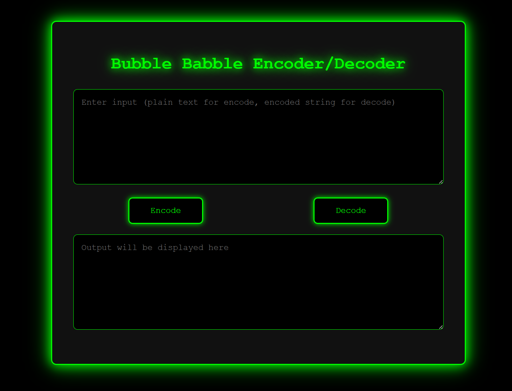

# Bubble Babble Encoder Decoder 🚀🔒





## 🌟 Overview
Welcome to the Bubble Babble Encoder Decoder! A sleek, cyberpunk-style web tool with a green-on-black hacker vibe 💻🕶️. Encode plain text into Bubble Babble format or decode it back with ease, all in your browser. Built with vanilla HTML, CSS, and JavaScript—no dependencies needed! Perfect for cryptography enthusiasts and developers. Ported from the Python bubblepy library, this tool is ready to hack the matrix. 🔐✨
⚡ Features

Encode Mode: Turn plain text (UTF-8) into Bubble Babble strings with checksums. 📤
Decode Mode: Reverse Bubble Babble strings to original text, with robust error checking. 📥
Hacker Aesthetic: Retro terminal design with glowing effects and animations. 🌑🟢
User-Friendly: Clear placeholders and error messages in the output field (no pop-ups!). 🚫❗
Responsive: Works on desktops, tablets, and phones. 📱💻
No Dependencies: Pure JS for easy deployment on GitHub Pages. 🌐
Smart Errors: Friendly feedback for invalid inputs, displayed directly in the output. 🛡️

## Watch the tool here https://mojtabafotohi.github.io/Bubble-Babble-Encoder-Decoder/
🛠️ How to Use

Input Field: Type plain text to encode or a Bubble Babble string (e.g., xigak-nyryk-hyryk-kyxex) to decode. 📝

Buttons: Hit Encode for Bubble Babble output or Decode to retrieve original text. 🔄

Output Field: Results show up instantly. Errors? Get helpful messages like "Decoding failed: Invalid format...". 📊

Example Encode: Input "Hello World" → Output like xigak-nyryk-hyryk-kyxex.
Example Decode: Paste the encoded string and click Decode to get "Hello World". 🎉


Open index.html in a browser to start! Host it on GitHub Pages for a live demo. 🌍
📦 Installation & Deployment

Clone the repo:
```bash
git clone https://github.com/MojtabaFotohi/Bubble-Babble-Encoder-Decoder.git
```

Navigate to the project:
```bash
cd Bubble-Babble-Encoder-Decoder
```

Open index.html in a browser. Done! 🏎️


For GitHub Pages:

Push to your repo.
Go to Settings > Pages > Set source to main branch.
Visit https://MojtabaFotohi.github.io/Bubble-Babble-Encoder-Decoder/. 📡

🤝 Contributing
Contributions are welcome! Fork the repo, tweak it, and send a pull request. Found a bug? Open an issue. Love it? Star it! ⭐

Bug Reports: Use the Issues tab. 🐛
Pull Requests: Follow GitHub flow. 🔄

📜 License
Licensed under the MIT License - see the LICENSE file. Free to use, modify, and share! 🆓
🙌 Acknowledgments

Inspired by the bubblepy Python library. 📚
Crafted with 💚 by MojtabaFotohi. 👨‍💻
Big thanks to the open-source community for shields.io badges! ❤️

Star the repo and share it with your fellow coders! 🚀🔥
